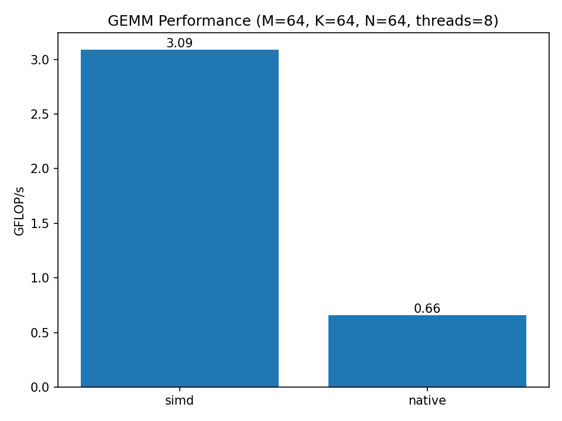
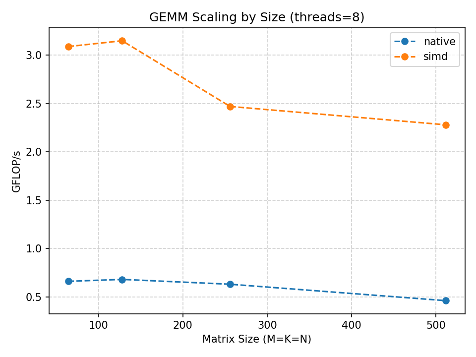

# 1. Overview
This is a benchmark for comparing native GEMM and SIMD GEMM implementations.
# 2. Build & Run
* **Build**   
At the project root directory, run the following commands:
    ```bash
    cmake -S . -B build -DMINIDL_BUILD_BENCHMARKS=ON \
  -DCMAKE_CXX_FLAGS="-Xpreprocessor -fopenmp -I/usr/local/opt/libomp/include" \
  -DCMAKE_EXE_LINKER_FLAGS="-L/usr/local/opt/libomp/lib -lomp"

    cmake --build ./build -j
    ```
* **Run**   
After building, you can run the GEMM benchmark:
    ```bash
    ./build/bin/bench_gemm
    ```
    You can also run a sweep test with sweep_gemm.sh, which will generate two log files in the ./build directory:
    ```bash
    ./benchmarks/sweep_gemm.sh
    ```
* **Visualize**   
    After generating the log files, you can visualize the benchmark results:
    ```bash
    python ./benchmarks/plot_gemm.py \
  --input build/bench_native.log:backend=native build/bench_simd.log:backend=simd \
  --outdir ./plots \
  --make bar line speedup
    ```
# 3. Result
The following results were obtained under this environment:
```
Hardware Overview:

      Model Name: MacBook Pro
      Model Identifier: MacBookPro16,3
      Processor Name: Quad-Core Intel Core i5
      Processor Speed: 1.4 GHz
      Number of Processors: 1
      Total Number of Cores: 4
      L2 Cache (per Core): 256 KB
      L3 Cache: 6 MB
      Hyper-Threading Technology: Enabled
      Memory: 16 GB
```
* GEMM Performance (M=64, K=64, N=64, threads=8)   

* GEMM Scaling by Size (threads=8)
